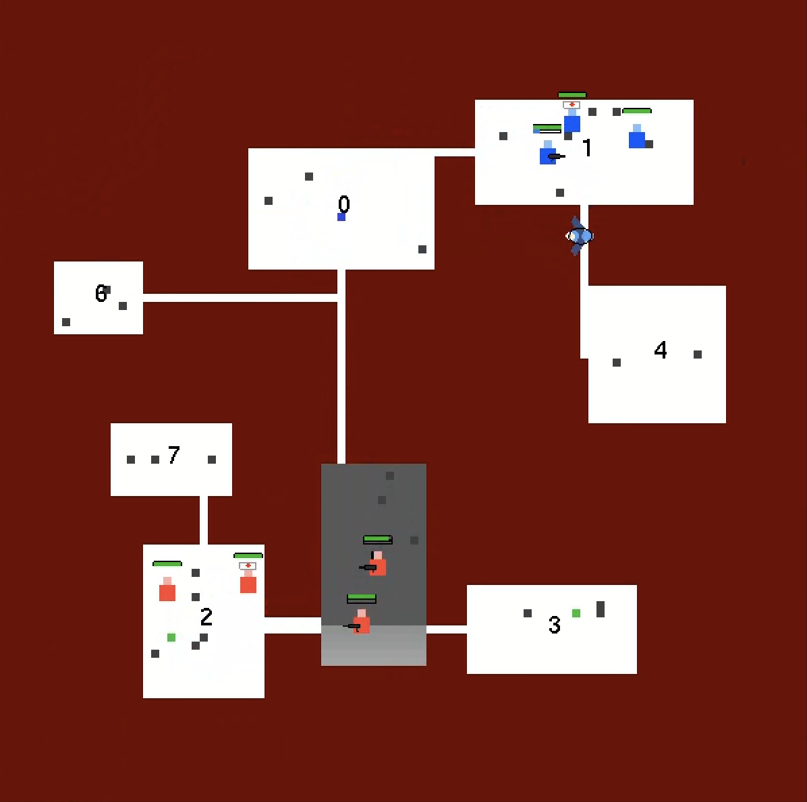

# AI Tactical Squad Battle Simulator



A real-time tactical AI battle simulator developed in **C++** using **OpenGL/GLUT**.
The project simulates autonomous squad-based combat between two intelligent teams operating inside a procedurally generated room-and-corridor environment.

Each team contains:
- Fighters
- Medics
- Supply Soldiers

The AI system is built using:
- Finite State Machines (FSM)
- Dynamic pathfinding
- Tactical combat behavior
- Health & ammo management
- Team coordination

---

# Features

## Procedural Dungeon Generation
- Random room generation
- Connected corridor system
- Path validation between rooms
- No duplicate corridors
- Dynamic room connectivity

---

## Team-Based AI Combat
Two independent AI-controlled teams battle each other.

Each team contains:
- 2 Fighters
- 1 Medic
- 1 Supply Soldier

Teams are spawned in distant rooms to create tactical movement and encounters.

---

# Fighter AI

Fighters are fully autonomous and capable of:

- Detecting enemy fighters
- Moving between rooms
- Shooting enemies
- Throwing grenades
- Managing health
- Managing ammunition
- Retreating when necessary
- Prioritizing enemy fighters over support units

Combat occurs dynamically when enemy fighters enter the same room.

---

# Medic AI

Medics:
- Follow friendly fighters
- Heal injured teammates
- Wear a visible white medic hat with a red cross
- Support frontline units during combat

---

# Supply Soldier AI

Supply soldiers:
- Carry ammunition supplies
- Refill fighter ammo
- Visit ammo depots when out of supplies
- Support nearby fighters

---

# Health & Ammo System

Each fighter contains:
- Health Points (HP)
- Ammo capacity
- Cooldowns
- Tactical thresholds

Visual indicators:
- Green/Yellow/Red HP Bar
- Blue Ammo Bar

---

# Tactical Behavior

The AI includes:
- Room-based combat
- Enemy detection
- Dynamic engagement
- Corridor blocking
- Movement restrictions during combat
- Team separation
- Smart target prioritization

---

# Visual Effects

## Combat Lighting
Dynamic room lighting during combat:
- Flash effects during shooting
- Explosion lighting
- Gradient combat illumination
- Dynamic darkening effects

---

## Character Rendering
Characters include:
- Team colors
- Weapons
- HP bars
- Ammo bars
- Medic hats
- Projectile rendering

---

# Pathfinding System

The project uses:
- BFS-based pathfinding
- Dynamic obstacle handling
- Corridor blocking
- Enemy-aware movement
- Room navigation

---

# Technologies

- C++
- OpenGL
- GLUT
- Object-Oriented Design
- FSM Architecture

---

# Project Structure

```text
Constants.h
State.h

NPC.h
NPC.cpp

Character.h
Character.cpp

World.h
World.cpp

Room.h
Room.cpp

PathPlanner.h
PathPlanner.cpp

Projectile.h
Projectile.cpp

ProjectileManager.h
ProjectileManager.cpp

FighterStates.h
FighterStates.cpp

MedicStates.h
MedicStates.cpp

SupplyStates.h
SupplyStates.cpp

MapItems.h
MapItems.cpp

GameSetup.h
GameTick.h

main.cpp
```

---

# AI Architecture

The AI system is based on Finite State Machines (FSM).

Example fighter states:
- FighterDecideState
- FighterMoveState
- FighterAttackState
- FighterRetreatState

This architecture allows:
- Modular AI behaviors
- Easy feature expansion
- Dynamic decision making
- Clean separation of responsibilities

---

# Gameplay Flow

1. Generate procedural dungeon
2. Spawn two teams in distant rooms
3. Fighters search for enemies
4. Teams engage in room combat
5. Medics heal allies
6. Supply soldiers refill ammo
7. Tactical combat continues until one team is eliminated

---

# Future Improvements

Possible future upgrades:
- Cover system
- Advanced tactical formations
- Sound effects
- Fog of war
- Smarter squad coordination
- Sniper units
- Machine learning AI
- Multiplayer support

---

# Authors

Developed as an AI tactical simulation project.

Adam Eljohari
Afeka College of Engineering

---

# Build & Run

## Requirements
- Visual Studio
- OpenGL
- GLUT/freeGLUT

---

## Run
Open the `.sln` file in Visual Studio and run:

```text
Ctrl + F5
```

---

# License

Educational / Academic Project.

